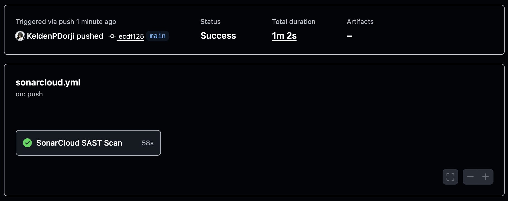
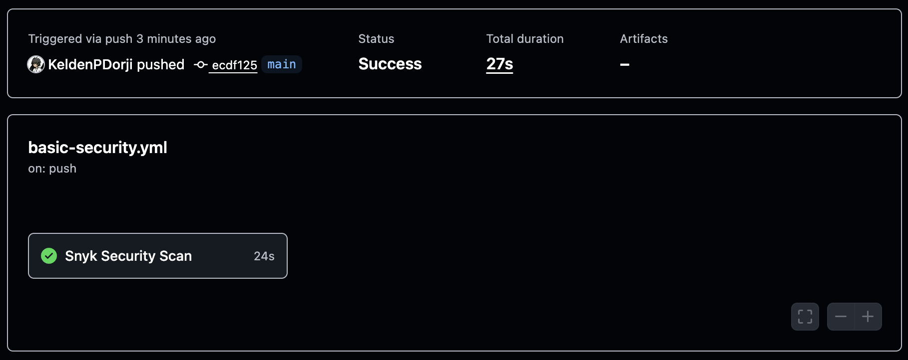
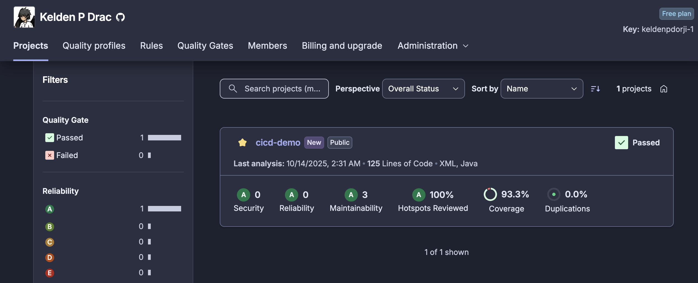

# Practical 4A - CI/CD Security Integration

Integration of SonarCloud and Snyk security scanning in GitHub Actions CI/CD pipeline.

## Implementation

Complete implementation available in separate repository: [cicd-demo_sq][repo]


## Overview

This practical demonstrates:
- Static Application Security Testing (SAST) with SonarCloud
- Dependency vulnerability scanning with Snyk
- Automated quality gates in GitHub Actions
- Security-first development workflow
- Continuous security monitoring
- Code quality metrics and reporting

## Prerequisites

- [GitHub account][github]
- [SonarCloud account][sonarcloud] (free for public repositories)
- [Snyk account][snyk] (free for open source projects)
- Java 11 or higher
- Maven 3.6 or higher
- Basic understanding of Git and CI/CD concepts

## Quick Start

```bash
# Clone the repository
git clone https://github.com/KeldenPDorji/cicd-demo_sq.git
cd cicd-demo_sq

# Build the project
mvn clean install

# Run tests with coverage
mvn test jacoco:report
```

## Setup Instructions

1. Fork or clone the [repository][repo]
2. Configure GitHub Secrets (4 required secrets):
   - `SNYK_TOKEN`
   - `SONAR_TOKEN`
   - `SONAR_ORGANIZATION`
   - `SONAR_PROJECT_KEY`
3. Enable GitHub Actions in repository settings
4. Push a commit to trigger the CI/CD pipeline

Detailed setup guide: [Repository Setup][repo-setup]

## Project Structure

```
cicd-demo_sq/
├── .github/
│   └── workflows/
│       ├── sonarcloud.yml              # SonarCloud SAST workflow
│       ├── basic-security.yml          # Snyk security scan
│       └── maven.yml                   # Build and test workflow
├── src/
│   ├── main/java/
│   │   └── sg/edu/nus/iss/cicddemo/
│   │       ├── CicdDemoApplication.java
│   │       └── Controller/
│   │           └── DataController.java
│   └── test/java/                      # Test cases
├── scripts/
│   ├── sonar-troubleshoot.sh           # SonarCloud debugging
│   └── server_*.sh                     # Server management scripts
├── pom.xml                             # Maven configuration
├── sonar-project.properties            # SonarCloud settings
└── README.md                           # Complete documentation
```

## Workflows Implemented

### Workflow 1: SonarCloud SAST Scan
**File**: `.github/workflows/sonarcloud.yml`
- Static code analysis
- Security vulnerability detection
- Code quality metrics
- Coverage reporting

### Workflow 2: Snyk Security Scan
**File**: `.github/workflows/basic-security.yml`
- Dependency vulnerability scanning
- License compliance checking
- Security recommendations
- Automated fix suggestions

### Workflow 3: Maven Build & Test
**File**: `.github/workflows/maven.yml`
- Project compilation
- Unit test execution
- Integration testing
- Combined security checks

## Test Execution

```bash
# Run all tests
mvn test

# Run with coverage report
mvn test jacoco:report

# Run SonarCloud analysis locally
mvn sonar:sonar

# Build without tests
mvn clean install -DskipTests
```

## Results & Screenshots

### 1. SonarCloud SAST Scan ✅
**Workflow**: `sonarcloud.yml` | **Duration**: ~1 minute | **SAST Scan**: 58s



*Successful Static Application Security Testing scan integrated with GitHub Actions*

### 2. Snyk Security Scan ✅  
**Workflow**: `basic-security.yml` | **Duration**: ~27s | **Security Scan**: 24s



*Dependency vulnerability scanning with Snyk detecting potential security issues*

### 3. SonarCloud Quality Dashboard ✅
**Project**: cicd-demo | **Lines of Code**: 125 (XML, Java) | **Quality Gate**: Passed



**Quality Metrics:**
- 🔒 **Security**: 0 issues (Grade A)
- 🛠️ **Reliability**: 0 issues (Grade A)  
- 📊 **Maintainability**: 3 issues (Grade A)
- 🔍 **Security Hotspots**: 100% reviewed
- 📈 **Code Coverage**: 93.3%
- 📋 **Duplications**: 0.0%

## Key Features

- **Automated Security Scanning**: Runs on every push and pull request
- **Quality Gate Enforcement**: Blocks merge if quality standards not met
- **Real-time Feedback**: Immediate security alerts in pull requests
- **Comprehensive Coverage**: Both SAST and dependency scanning
- **Production-Ready**: Industry-standard security tools

## Technical Implementation

- **SonarCloud Integration**: Maven plugin with JaCoCo coverage
- **Snyk Integration**: GitHub Actions native integration
- **Secret Management**: GitHub Secrets for secure token storage
- **Multi-Workflow Setup**: Parallel execution for faster feedback
- **Automated Reporting**: Results visible in GitHub UI

## Troubleshooting

```bash
# SonarCloud issues - run troubleshooting script
./scripts/sonar-troubleshoot.sh

# Manual cache cleanup
mvn clean
rm -rf ~/.sonar/cache/*

# Rebuild with fresh analysis
mvn compile test jacoco:report sonar:sonar
```

### Common Issues

- **InvalidProtocolBufferException**: Clear SonarCloud cache and rebuild
- **"Could not find default branch"**: Verify project key in SonarCloud settings
- **Snyk authentication failed**: Check `SNYK_TOKEN` validity and permissions
- **Coverage not showing**: Ensure JaCoCo plugin is configured correctly

## Learning Outcomes

1. Integration of SAST tools into CI/CD pipelines
2. Configuration of automated security scanning workflows
3. Interpretation of security scan results and metrics
4. Implementation of quality gates and enforcement policies
5. Best practices for security-first development approach
6. GitHub Actions workflow creation and debugging

## Expected Results

After successful setup, you should see:

### GitHub Actions
- ✅ All workflows passing
- ✅ SonarCloud scan completed (~1 minute)
- ✅ Snyk scan completed (~27 seconds)
- ✅ Build and test successful

### SonarCloud Dashboard
- ✅ Quality Gate: Passed
- ✅ Security: Grade A (0 issues)
- ✅ Reliability: Grade A (0 issues)
- ✅ Maintainability: Grade A
- ✅ Code Coverage: >90%

### Snyk Analysis
- ✅ Dependencies scanned
- ✅ Vulnerabilities identified (if any)
- ✅ Fix recommendations provided
- ✅ License compliance checked

## Submission Guidelines

1. ✅ Ensure all GitHub Actions workflows are passing
2. ✅ Capture screenshots of SonarCloud and Snyk results
3. ✅ Document any issues encountered and how you resolved them
4. ✅ Include your SonarCloud project URL in submission
5. ✅ Verify all security scans completed successfully
6. ✅ Submit workflow execution logs if requested

## Assessment Criteria

- **Setup Completion** (30%): All tools properly configured with correct secrets
- **Pipeline Success** (30%): All workflows executing successfully
- **Security Analysis** (20%): Both SonarCloud and Snyk scans completed
- **Documentation** (10%): Clear explanation of setup and results
- **Problem Solving** (10%): Ability to troubleshoot and resolve issues

---

For detailed implementation, configuration files, and advanced troubleshooting, visit the [complete repository][repo].

<!-- Reference Links -->
[repo]: https://github.com/KeldenPDorji/cicd-demo_sq
[repo-setup]: https://github.com/KeldenPDorji/cicd-demo_sq#quick-setup
[actions]: https://github.com/KeldenPDorji/cicd-demo_sq/actions
[sonarcloud-project]: https://sonarcloud.io/project/overview?id=KeldenPDorji_cicd-demo_sq
[github]: https://github.com
[sonarcloud]: https://sonarcloud.io
[snyk]: https://snyk.io

