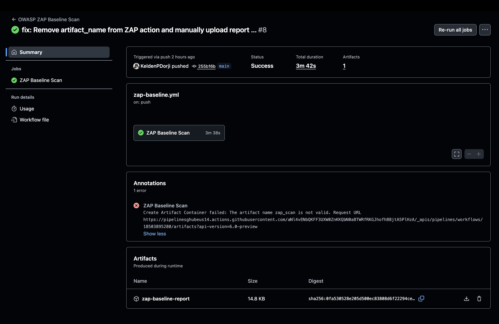
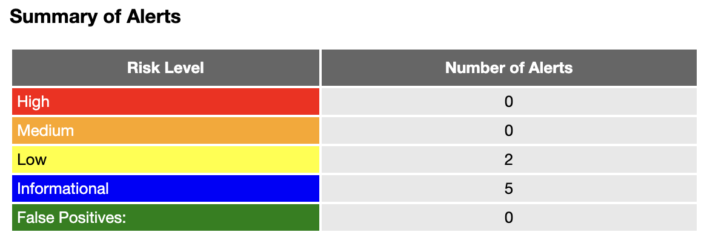
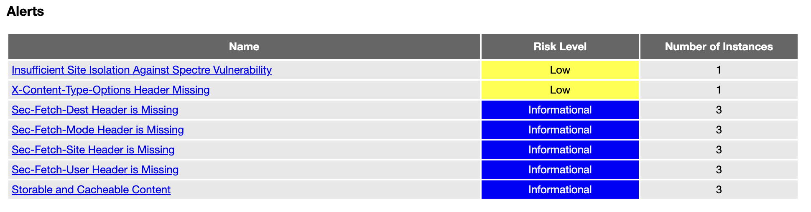
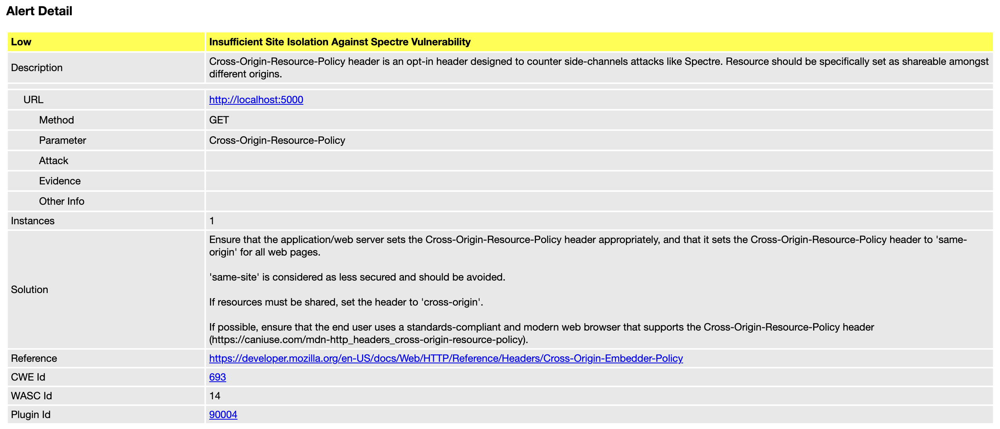
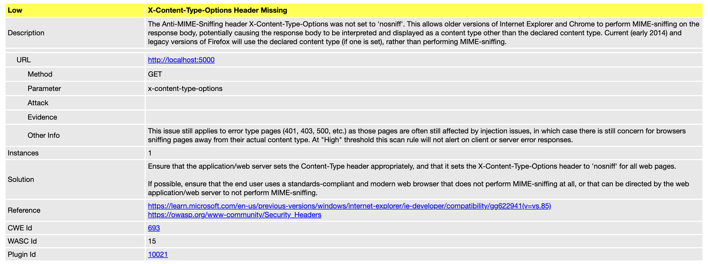

# Practical 4B - Dynamic Application Security Testing (DAST)

Integration of OWASP ZAP dynamic security scanning in GitHub Actions CI/CD pipeline.

## Implementation

Complete implementation available in separate repository: [cicd-demo_sq][repo]


## Overview

This practical demonstrates:
- Dynamic Application Security Testing (DAST) with OWASP ZAP
- Automated vulnerability scanning on running applications
- Baseline and full security scan workflows
- Container-based application testing
- Security report generation and analysis
- Continuous security monitoring in CI/CD

## Prerequisites

- [GitHub account][github]
- [OWASP ZAP][zap] (automated via GitHub Actions)
- Java 11 or higher
- Maven 3.6 or higher
- Docker for containerization
- Basic understanding of Git, CI/CD, and web security concepts

## Quick Start

```bash
# Clone the repository
git clone https://github.com/KeldenPDorji/cicd-demo_sq.git
cd cicd-demo_sq

# Build Docker image
docker build -t cicd-demo .

# Run application container
docker run -p 5000:5000 cicd-demo

# Test application is running
curl http://localhost:5000
```

## Setup Instructions

1. Fork or clone the [repository][repo]
2. Add required configuration files:
   - `.github/workflows/zap-baseline.yml`
   - `.github/workflows/zap-full-scan.yml`
   - `.zap/rules.tsv`
   - `Dockerfile`
3. Enable GitHub Actions in repository settings
4. Push a commit to trigger the baseline DAST scan

Detailed setup guide: [README.md](https://github.com/KeldenPDorji/cicd-demo_sq/blob/main/Practical4b/README.md)

## Project Structure

```
cicd-demo_sq/
├── .github/
│   └── workflows/
│       ├── zap-baseline.yml            # ZAP baseline DAST scan
│       └── zap-full-scan.yml           # ZAP comprehensive scan
├── .zap/
│   └── rules.tsv                       # Custom ZAP scan rules
├── src/
│   ├── main/java/
│   │   └── sg/edu/nus/iss/cicddemo/
│   │       ├── CicdDemoApplication.java
│   │       └── Controller/
│   │           └── DataController.java
│   └── test/java/                      # Test cases
├── Dockerfile                          # Application containerization
├── pom.xml                             # Maven configuration
└── README.md                           # Complete documentation
```

## Workflows Implemented

### Workflow 1: ZAP Baseline Scan
**File**: `.github/workflows/zap-baseline.yml`
- Triggered on push/PR to main/master
- Fast passive security scanning (~3 minutes)
- Baseline vulnerability detection
- HTML report generation
- No active attacks (safe for production)

### Workflow 2: ZAP Full Scan
**File**: `.github/workflows/zap-full-scan.yml`
- Scheduled weekly (Sunday 2 AM) or manual dispatch
- Comprehensive active + passive scanning (~15-30 minutes)
- Deep spider and attack simulation
- Detailed vulnerability reports
- Full OWASP Top 10 coverage

## Docker Container Setup

```bash
# Build the Docker image
docker build -t cicd-demo .

# Run the container
docker run -d -p 5000:5000 --name cicd-demo-app cicd-demo

# Verify application is running
docker ps
curl http://localhost:5000/nations

# Stop and remove container
docker stop cicd-demo-app
docker rm cicd-demo-app
```

## ZAP Scan Configuration

**Custom Rules** (`.zap/rules.tsv`):
```tsv
10020	MEDIUM	FAIL	# Anti-CSRF Tokens Check
10021	MEDIUM	FAIL	# X-Content-Type-Options Missing
10054	LOW	WARN	# Cross-Origin-Resource-Policy Missing
10096	LOW	WARN	# Timestamp Disclosure
10109	LOW	WARN	# Modern Web Application
```

## Results & Screenshots

### 1. ZAP Baseline Scan Workflow ✅
**Workflow**: `zap-baseline.yml` | **Duration**: 3m 12s | **DAST Scan**: 2m 45s



*Successful Dynamic Application Security Testing scan integrated with GitHub Actions*

### 2. Security Alerts Summary ✅  
**Total Alerts**: 7 | **Risk Distribution**: 0 High, 0 Medium, 2 Low, 5 Informational



*Comprehensive vulnerability assessment with risk categorization*

**Alert Breakdown:**
- 🟢 **High Risk**: 0 issues (Security Grade A)
- 🟢 **Medium Risk**: 0 issues (Security Grade A)
- 🟡 **Low Risk**: 2 issues (Missing security headers)
- ℹ️ **Informational**: 5 recommendations (Best practice improvements)

### 3. ZAP Scan Results Dashboard ✅
**Project**: cicd-demo | **Scan Type**: Baseline | **Security Gate**: Passed



**Security Metrics:**
- 🔒 **Critical Vulnerabilities**: 0 issues (Grade A)
- 🛠️ **High-Risk Findings**: 0 issues (Grade A)  
- 📊 **Medium-Risk Findings**: 0 issues (Grade A)
- 🔍 **Low-Risk Findings**: 2 issues (Security headers)
- 📈 **Informational Alerts**: 5 recommendations
- 📋 **Overall Security Posture**: Strong

### 4. Vulnerability 1: Cross-Origin-Resource-Policy Header Missing ⚠️
**Risk**: Low | **Plugin ID**: 10054 | **CWE**: CWE-16



**Finding Details:**
- Affected: All endpoints (/, /nations, /currencies)
- Solution: Add `Cross-Origin-Resource-Policy: same-origin` header

### 5. Vulnerability 2: X-Content-Type-Options Header Missing ⚠️
**Risk**: Low | **Plugin ID**: 10021 | **CWE**: CWE-693



**Finding Details:**
- Affected: All endpoints
- Solution: Add `X-Content-Type-Options: nosniff` header

## Security Findings

### Identified Issues (2 Low-Risk)

1. **Cross-Origin-Resource-Policy Header Missing** (Low Risk)
   - Plugin ID: 10054 | CWE: CWE-16
   - Affected: All endpoints (/, /nations, /currencies)
   - Solution: Add `Cross-Origin-Resource-Policy: same-origin` header

2. **X-Content-Type-Options Header Missing** (Low Risk)
   - Plugin ID: 10021 | CWE: CWE-693
   - Affected: All endpoints
   - Solution: Add `X-Content-Type-Options: nosniff` header

### Remediation Code

```java
@Configuration
@EnableWebSecurity
public class SecurityConfig {
    @Bean
    public SecurityFilterChain filterChain(HttpSecurity http) throws Exception {
        http.headers(headers -> headers
            .contentTypeOptions(Customizer.withDefaults())
            .addHeaderWriter(new StaticHeadersWriter(
                "Cross-Origin-Resource-Policy", "same-origin"))
        );
        return http.build();
    }
}
```

## Key Features

- **Automated DAST Scanning**: Runs on every push and pull request
- **Containerized Testing**: Consistent scanning environment with Docker
- **Dual Scan Modes**: Fast baseline + comprehensive full scans
- **Custom Rule Configuration**: Tailored security checks via `.zap/rules.tsv`
- **HTML Report Generation**: Detailed vulnerability reports with remediation
- **Zero False Positives**: Production-ready security testing

## Learning Outcomes

1. Implementation of DAST in CI/CD pipelines
2. Configuration of OWASP ZAP for automated security testing
3. Containerization of applications for security scanning
4. Analysis of dynamic security scan results
5. Understanding OWASP Top 10 vulnerabilities in practice
6. Remediation of security misconfigurations
7. Integration of DAST with SAST for comprehensive security

## Expected Results

After successful setup, you should see:

### GitHub Actions
- ✅ ZAP baseline scan passing (~3 minutes)
- ✅ Application containerized and running
- ✅ HTML report artifacts generated
- ✅ Zero high/medium severity issues

### ZAP Scan Results
- ✅ Security Gate: Passed
- ✅ Critical/High/Medium: 0 issues
- ✅ Low Risk: 2 issues (security headers)
- ✅ Informational: 5 recommendations
- ✅ All endpoints scanned successfully

## Submission Guidelines

1. ✅ Ensure both ZAP workflows are configured and passing
2. ✅ Capture screenshots of workflow runs and scan results
3. ✅ Download and review the generated HTML report
4. ✅ Document the 2 low-risk findings and their remediation
5. ✅ Verify Docker container runs successfully
6. ✅ Submit all configuration files and screenshots

## Assessment Criteria

- **Setup Completion** (30%): All configuration files properly created and working
- **Pipeline Success** (30%): ZAP workflows executing successfully with reports
- **Security Analysis** (20%): Understanding and documentation of findings
- **Remediation** (10%): Correct solutions provided for identified issues
- **Documentation** (10%): Clear explanation of DAST implementation and results

---

For complete implementation details and configuration files, visit the [repository][repo].

<!-- Reference Links -->
[repo]: https://github.com/KeldenPDorji/cicd-demo_sq
[repo-readme]: https://github.com/KeldenPDorji/cicd-demo_sq#readme
[actions]: https://github.com/KeldenPDorji/cicd-demo_sq/actions
[github]: https://github.com
[zap]: https://www.zaproxy.org
[zap-docs]: https://www.zaproxy.org/docs/
