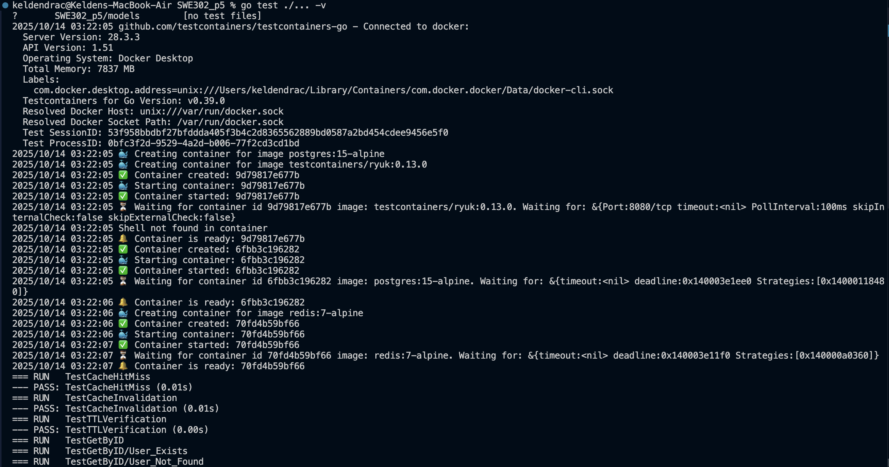
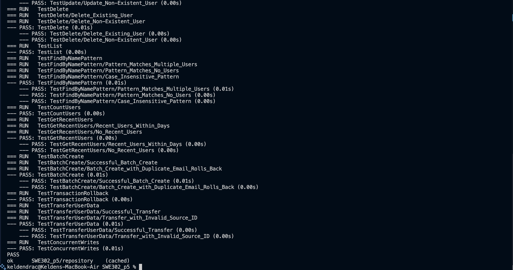

# Practical 5 - TestContainers Integration Testing

Implementation of integration testing using TestContainers for PostgreSQL and Redis in Go.

## Implementation

Complete implementation available in separate repository: [SWE302_p5](https://github.com/KeldenPDorji/SWE302_p5)

## Overview

This practical demonstrates:
- Integration testing with TestContainers
- PostgreSQL database testing
- Redis caching integration
- Full CRUD operations with advanced queries
- Transaction testing and isolation
- Multi-container setup

## Prerequisites

- Go 1.21 or higher
- Docker Desktop running
- ~500MB disk space for Docker images

## Quick Start

```bash
# Clone the repository
git clone https://github.com/KeldenPDorji/SWE302_p5.git
cd SWE302_p5

# Download dependencies
go mod download

# Run all tests
go test ./... -v
```

## Project Structure

```
SWE302_p5/
├── models/
│   └── user.go                          # User data model
├── repository/
│   ├── user_repository.go               # Basic CRUD operations
│   ├── user_repository_test.go          # Integration tests (Exercises 1-4)
│   ├── cached_user_repository.go        # Redis caching layer
│   └── cached_user_repository_test.go   # Multi-container tests (Exercise 5)
├── migrations/
│   └── init.sql                         # Database schema
├── go.mod                               # Dependencies
└── README.md                            # Project documentation
```

## Exercises Implemented

### Exercise 1-2: Basic CRUD Operations
CRUD operations with PostgreSQL

### Exercise 3: Advanced Queries
Pattern matching, counting, and date filtering

### Exercise 4: Transaction Testing
Batch operations, rollback verification, and concurrent access

### Exercise 5: Multi-Container Testing
Redis caching with cache hit/miss, invalidation, and TTL

## Test Execution

### Running All Tests
```bash
go test ./... -v
```

**Test Output:**





### Coverage Analysis
```bash
go test -cover ./repository
```


## Test Results

✅ **17 tests passing** | 83.3% coverage | PostgreSQL 15-alpine + Redis 7-alpine

| Exercise | Tests |
|----------|-------|
| CRUD Operations | 6 tests |
| Advanced Queries | 3 tests |
| Transactions | 5 tests |
| Multi-Container Caching | 3 tests |

## Key Features

- Real PostgreSQL and Redis containers (not mocks)
- Automatic container lifecycle management
- Test isolation with clean state
- Production-like testing environment
- Multi-container orchestration

## Learning Outcomes

- Integration testing with TestContainers
- Database transaction management
- Cache integration patterns
- Multi-container testing strategies

## Why TestContainers?

| Traditional Approach | TestContainers Approach |
|---------------------|------------------------|
| Mock databases (not realistic) | Real PostgreSQL & Redis |
| Shared test DB (flaky tests) | Isolated containers |
| Manual setup/teardown | Automatic lifecycle |
| Hard to CI/CD | Docker-based, portable |
| Different from production | Production-like environment |

## Resources

- [TestContainers Go Documentation](https://golang.testcontainers.org/)
- [PostgreSQL Module](https://golang.testcontainers.org/modules/postgres/)
- [Redis Module](https://golang.testcontainers.org/modules/redis/)
- [Implementation Repository](https://github.com/KeldenPDorji/SWE302_p5)

---

*Part of AS2025SWE302 - Software Testing & Quality Assurance*
